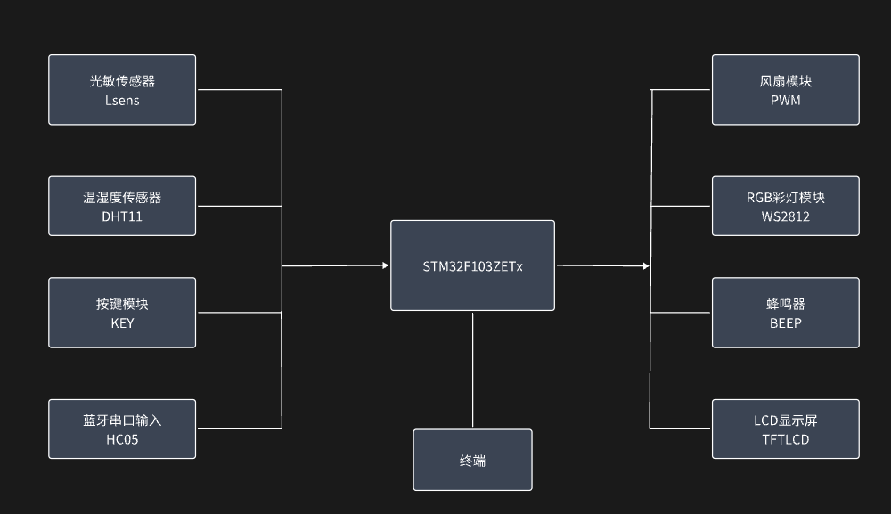

# 🐾 Smart Pet Care System

#  (STM32-based)

本项目为基于 STM32F103ZETx 单片机的智能宠物照护系统，集成多种环境传感器、自动控制机制和可视化交互界面，具备蓝牙远程控制与图形反馈能力，适用于智能宠物屋、智能温控箱等场景。

---

## 项目亮点

- **多传感器融合感知**：DHT11 温湿度传感器 + 光敏传感器，实时获取环境数据；
- **自动控制逻辑**：支持风扇、照明、蜂鸣器的联动自动控制；
- **三种页面交互显示**：支持 LCD 多页面切换，图形化显示宠物“情绪”；
- **WS2812 彩灯图案绘制**：5×5 LED 点阵支持动态爱心图案与多色照明；
- **蓝牙交互控制**：通过 HC05 模块支持串口指令控制各类设备；
- **状态分级告警**：支持 Normal / Warning / Alarm 三种状态管理与颜色标识；
- **完整命令解析器**：支持 FAN/LIGHT/BEEP/AUTO 控制与 STATUS 查询。

---

## 🛠️ 使用硬件

| 模块名称               | 功能描述                    |
| ---------------------- | --------------------------- |
| STM32F103ZETx          | 系统主控单片机              |
| 温湿度模块（DHT11）    | 实时采集环境温度与湿度      |
| 光敏模块（Lsens）      | 检测环境光照强度            |
| RGB 彩灯模块（WS2812） | 彩色点阵照明与图案装饰显示  |
| 蓝牙模块（HC05）       | 蓝牙通信，实现远程控制      |
| LCD 屏（TFTLCD）       | 图形化界面，显示状态与数据  |
| 按键模块（KEY）        | 控制页面切换与模式选择      |
| 蜂鸣器（BEEP）         | 系统告警输出与音乐播放功能  |
| 风扇（PWM）            | 温控风速调节，自动/手动控制 |

---

## 系统功能结构

---

## 支持的蓝牙命令（通过串口发送）

| 指令            | 功能                   |
| --------------- | ---------------------- |
| `+FAN ON/OFF`   | 打开/关闭风扇          |
| `+LIGHT ON/OFF` | 打开/关闭照明          |
| `+BEEP ON/OFF`  | 打开/关闭蜂鸣器        |
| `+AUTO ON/OFF`  | 开启/关闭自动控制模式  |
| `+STATUS?`      | 查询当前环境与设备状态 |
| `+music on`     | 播放音乐样例           |

---

## 页面展示说明（LCD）

1. **PAGE_ROLE_STATUS**  
   显示系统状态（颜色标识）、蓝牙角色、连接状态；

2. **PAGE_ENV_DEVICE**  
   显示温度、湿度、光照值 + 风扇、照明、蜂鸣器状态 + 自动控制状态；

3. **PAGE_PICTURE**  
   根据环境显示对应宠物情绪图像（正常 / 炎热 / 光照过强）；

---

## 按键功能

| 按键     | 功能             |
| -------- | ---------------- |
| `KEY0`   | 页面切换         |
| `KEY_UP` | 切换自动控制开关 |
| `KEY1`   | 手动风扇开关控制 |

---

## 项目结构说明

.
├── README.md                        # 项目说明文档
├── main.c                           # 主程序入口（系统初始化与主循环）
├── APP/                             # 功能模块目录
│   ├── pet_care/                    # 宠物照护核心逻辑（自动控制、页面切换）
│   ├── dht11/                       # 温湿度传感器驱动
│   ├── lsens/                       # 光敏传感器驱动
│   ├── ws2812/                      # RGB 彩灯控制与图案绘制
│   ├── beep/                        # 蜂鸣器控制
│   ├── pwm/                         # 风扇 PWM 调速控制
│   ├── hc05/                        # 蓝牙模块初始化与状态查询
│   ├── usart3/                      # 蓝牙串口通信命令解析
│   ├── key/                         # 按键输入处理（页面切换/控制）
│   ├── tftlcd/                      # LCD 显示与图像显示
│   └── led/, time/, touch/, iic/   # 其他模块（部分未使用）
│
├── Public/                          # 公共函数模块
│   ├── system.c/h                   # 系统初始化配置
│   ├── SysTick.c/h                  # 毫秒延时函数
│   └── usart.c/h                    
│
├── Libraries/                       # STM32 标准库
│   ├── CMSIS/                       # Cortex-M3 核心支持文件
│   └── STM32F10x_StdPeriph_Driver/ # STM32外设驱动源码（GPIO/USART等）
│
├── img/                             # 图片资源（结构图等）
│   └── structure.png
├── Template.uvprojx 等             # Keil 工程文件
└── DebugConfig/, Obj/, User/       # 编译中间文件，可忽略

<pre> ├── <b>README.md</b>                         # 项目说明文档 ├── <b>main.c</b>                            # 主程序入口（系统初始化与主循环） ├── <b>APP/</b>                              # 功能模块目录 │   ├── <b>pet_care/</b>                     # 宠物照护系统核心逻辑（自动控制、页面切换等） │   ├── <b>dht11/</b>                        # 温湿度传感器驱动 │   ├── <b>lsens/</b>                        # 光敏传感器驱动 │   ├── <b>ws2812/</b>                       # RGB 彩灯控制，含爱心绘图函数 │   ├── <b>beep/</b>                         # 蜂鸣器控制模块 │   ├── <b>pwm/</b>                          # PWM 驱动模块，用于风扇调速 │   ├── <b>hc05/</b>                         # 蓝牙模块 HC05 初始化与角色识别 │   ├── <b>usart3/</b>                       # 串口3（蓝牙通信）接收与指令处理 │   ├── <b>key/</b>                          # 按键驱动模块，支持多按键识别 │   ├── <b>tftlcd/</b>                       # TFT LCD 显示驱动与图片资源 │   ├── <b>led/</b>                          # LED 状态灯模块 │   └── 其他（touch/, iic/, 24Cxx/ 等）       # 预留或未使用模块 │ ├── <b>Public/</b>                           # 公共函数模块（系统初始化、中断、串口等） │   ├── system.c/h │   ├── SysTick.c/h │   └── usart.c/h │ ├── <b>Libraries/</b>                        # STM32 标准库 │   ├── CMSIS/                               # ARM Cortex-M3 核心支持库 │   └── STM32F10x_StdPeriph_Driver/          # STM32 外设驱动库（GPIO/TIM等） │ ├── <b>img/</b>                              # 项目结构图等图片资源 │   └── structure.png ├── <b>Template.uvprojx</b> 等               # Keil 工程配置文件 └── <b>DebugConfig/、Obj/、User/</b>         </pre>

| 文件/文件夹    | 说明                         |
| -------------- | ---------------------------- |
| `main.c`       | 主控流程入口，处理按键+串口  |
| `pet_care.c/h` | 系统功能模块（核心控制逻辑） |
| `ws2812.c/h`   | RGB彩灯绘图、爱心图案显示    |
| `usart3.c/h`   | 蓝牙串口控制器               |
| `tftlcd.c/h`   | LCD 显示支持                 |
| `key.c/h`      | 按键处理                     |
| `dht11.c/h`    | 温湿度传感器驱动             |
| `lsens.c/h`    | 光敏传感器驱动               |
| `hc05.c/h`     | 蓝牙模块初始化与角色获取     |

---

## 项目总结

本系统实现了软硬件高度集成与良好的交互体验，适合用于物联网智能设备嵌入式开发入门、课程设计、嵌入式大作业展示等应用场景。